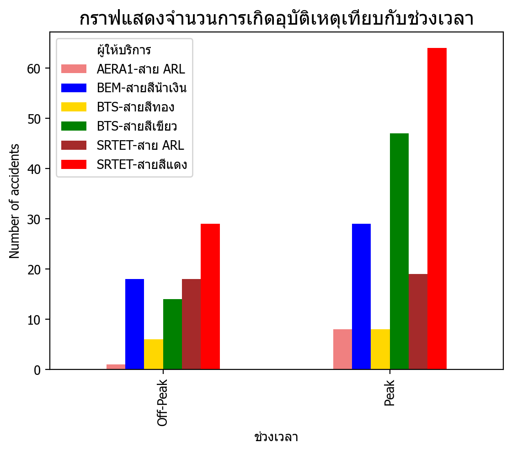

# miniproject_DADS5001

# Topic: อุบัติเหตุทางรถไฟฟ้าที่ไม่ควรทำให้เราเสียเวลา และควรจัดการสาเหตุการเกิดปัญหาอย่างจริงจัง

# Author
นายภูมิ เจวประเสริฐพันธุ์ ID:6420412004 

# Dataset Information
  ข้อมูลที่ระบุจำนวนครั้งในการเกิดเหตุขัดข้อง รวมถึงสาเหตุที่ทำให้รถไฟฟ้าขัดข้อง ของรถไฟฟ้าประเภทต่างๆ เช่น เดือน วันที่เกิดเหตุ เวลา ขบวนรถ เส้นทาง สถานีที่เกิดเหตุขัดข้อง ระยะเวลาล่าช้า(นาที) ผู้ให้บริการ สาเหตุ รายละเอียด
  
# Library and Install
```
import sys
import pandas as pd
from pandas import DataFrame
import numpy as np
import matplotlib.pyplot as plt
import matplotlib as mpl
import seaborn as sns
%matplotlib inline
%config InlineBackend.figure_format='retina'
plt.rcParams['font.family']='Tahoma' 
```

  
# Challenge
  1.มีปัญหาในการหาและนำเข้า dataset เข้ามาใน jupyter notebook เพราะว่ากว่าจะหาข้อมูลที่มีอะไรมาวิเคราะห์ได้ ต้องใช้เวลานาน
  
  2.ปัญหาการตั้งกราฟ เพราะว่าทำข้อมูลที่เป็น multiindex และมี 3 index  ทำให้ไม่รู้ว่าจะ สร้างกราฟยังไงดี เลยต้องไป clean data ใหม่โดยรวมdata 2 column เข้าด้วยกัน
  
  3.ตอน plot graph สาเหตุเทียบกับระยะเวลาล่าช้า(นาที) แล้ว index ที่ 2 ไม่เท่ากันทำให้ plot graph ออกมาแล้วดูเยอะเกินไป และดูยาก
  
  4.มีปัญหาตรงข้อมูลเป็นภาษาไทยเวลา สร้างกราฟเลยต้องเสียเวลาหา font ภาษาไทย
  
  5.sort data ที่เป็น multiindex  ที่มี 2 values ไม่ได้เลยต้องแยกเป็น 2 ตาราง 


# Analysis Question and Answer

  1. วิเคราะห์ว่าแต่ละช่วงเวลา(ช่วงเวลาเร่งด่วน(Peak Hour),ช่วงเวลาไม่เร่งด่วน(Off-Peak Hour)รถไฟฟ้าประเภทไหนที่เกิดเหตุขัดข้องบ่อยที่สุด 
  โดยกำหนด
  ช่วงเวลาเร่งด่วน(5.00 น.- 10.00 น.,17.01 น.-24.01 น.)
  ช่วงเวลาไม่เร่งด่วน(10.01 น.-17.00 น.)
  
  ตอบ  	
```
จำนวนการเกิดอุบัติเหตุ
ช่วงเวลา	      ผู้ให้บริการ	
Off-Peak	  AERA1-สาย ARL	1
            BEM-สายสีน้ำเงิน	18
            BTS-สายสีทอง	6
            BTS-สายสีเขียว	14
            SRTET-สาย ARL	18
            SRTET-สายสีแดง	29
Peak	      AERA1-สาย ARL	8
            BEM-สายสีน้ำเงิน	29
            BTS-สายสีทอง	8
            BTS-สายสีเขียว	47
            SRTET-สาย ARL	19
            SRTET-สายสีแดง	64
```

จากข้อมูล อุบัติเหตุที่เกิดในช่วงเวลาเร่งด่วน (Peak Hour)
```
SRTET-สายสีแดง 64 ครั้ง
BTS-สายสีเขียว 47 ครั้ง
BEM-สายสีน้ำเงิน 29 ครั้ง
SRTET-สาย ARL 19 ครั้ง
BTS-สายสีทอง 8 ครั้ง
AERA1-สาย ARL  8 ครั้ง
```

และ อุบัติเหตุที่เกิดในช่วงเวลาไม่เร่งด่วน (Off-Peak Hour)
```
SRTET-สายสีแดง 29 ครั้ง
SRTET-สาย ARL 18 ครั้ง
BEM-สายสีน้ำเงิน 18 ครั้ง
BTS-สายสีเขียว 14 ครั้ง
BTS-สายสีทอง 6 ครั้ง
AERA1-สาย ARL  1 ครั้ง
```
โดยกราฟจะได้ดังนี้


  2. วิเคราะห์ว่าจากสาเหตุต่างๆ รถไฟฟ้าประเภทไหน ที่ดำเนินการซ่อมแซมที่มีระยะเวลาสูงกว่าค่าเฉลี่ย
  
  ตอบ 
  
 ของรถไฟฟ้าแต่ละประเภท.png)

```  
                                              ค่าเฉลี่ยของระยะเวลาล่าช้า (นาที)
ผู้ให้บริการ	              สาเหตุ	
AERA1-สาย ARL	    ระบบขับเคลื่อนรถไฟฟ้า	                  1.67
                  ระบบอาณัติสัญญาณและการควบคุม	        6.67
                  ระบบเบรก	                           4.00
BEM-สายสีน้ำเงิน	   ระบบขับเคลื่อนรถไฟฟ้า	                 3.17
                  วัสดุแปลกปลอม	                       10.00
                  ระบบประตู	                           3.31
                  ระบบอาณัติสัญญาณและการควบคุม	        3.36
                  ระบบเบรก	                           2.38
BTS-สายสีทอง	     วัสดุแปลกปลอม	                      0.00
                  จุดสับราง	                            0.00
                  ระบบจ่ายไฟฟ้าขับเคลื่อน	                 0.00
                  ระบบอาณัติสัญญาณและการควบคุม	        0.00
BTS-สายสีเขียว	    ผู้โดยสาร	                             0.00
                  ระบบขับเคลื่อนรถไฟฟ้า	                  0.00
                  วัสดุแปลกปลอม	                        0.00
                  จุดสับราง	                             0.00
                  ระบบประตู	                            0.54
                  ระบบอาณัติสัญญาณและการควบคุม	        0.00
                  ระบบเบรก	                           0.83
                  ไม่ทราบสาเหตุ	                        0.00
SRTET-สาย ARL	    ระบบขับเคลื่อนรถไฟฟ้า	                  0.67
                  วัสดุแปลกปลอม	                       0.00
                  จุดสับราง	                            10.00
                  ระบบจ่ายไฟฟ้าขับเคลื่อน	                10.00
                  ระบบประตู	                           3.33
                  ระบบอาณัติสัญญาณและการควบคุม	        5.00
                  ระบบเบรก	                          1.40
                  ไม่ทราบสาเหตุ	                        0.00
SRTET-สายสีแดง	  ผู้โดยสาร	                            14.00
                  ระบบขับเคลื่อนรถไฟฟ้า	                 22.00
                  วัสดุแปลกปลอม	                       8.00
                  จุดสับราง	                            1.74
                  ระบบจ่ายไฟฟ้าขับเคลื่อน	                8.11
                  ระบบประตู	                           6.29
                  ระบบอาณัติสัญญาณและการควบคุม	       6.02
                  ระบบเบรก	                          5.67
                  ไม่ทราบสาเหตุ	                       0.00
```

  จากกราฟ และข้อมูลเราจะเห็นว่าค่าเฉลี่ยที่ได้คือ 3.73
  
  และจะได้รถไฟฟ้าที่ดำเนินการซ่อมแซมเป็นระยะเวลาสูงกว่าค่าเฉลี่ยทั้งหมด 4 ประเภท 13 สาเหตุ

ได้แก่

โดยเรียงลำดับจากรถไฟฟ้าที่ซ่อมนานที่สุดไปน้อยที่สุด
                                      
1.SRTET-สายสีแดง    ระบบขับเคลื่อนรถไฟฟ้า	          22.00 นาที

2.SRTET-สายสีแดง    ผู้โดยสาร	                    14.00 นาที

3.BEM-สายสีน้ำเงิน	  วัสดุแปลกปลอม	                10.00 นาที

4.SRTET-สาย ARL	   จุดสับราง	                    10.00 นาที

5.SRTET-สาย ARL    ระบบจ่ายไฟฟ้าขับเคลื่อน	        10.00 นาที

6.SRTET-สายสีแดง    ระบบจ่ายไฟฟ้าขับเคลื่อน	         8.11 นาที

7.SRTET-สายสีแดง    วัสดุแปลกปลอม	                8.00 นาที

8.AERA1-สาย ARL	   ระบบอาณัติสัญญาณและการควบคุม	  6.67 นาที

9.SRTET-สายสีแดง    ระบบประตู	                     6.29 นาที

10.SRTET-สายสีแดง    ระบบอาณัติสัญญาณและการควบคุม	 6.02 นาที

11.SRTET-สายสีแดง    ระบบเบรก	                    5.67 นาที

12.SRTET-สาย ARL	   ระบบอาณัติสัญญาณและการควบคุม	 5.00 นาที

13.AERA1-สาย ARL	   ระบบเบรก	                    4.00 นาที

