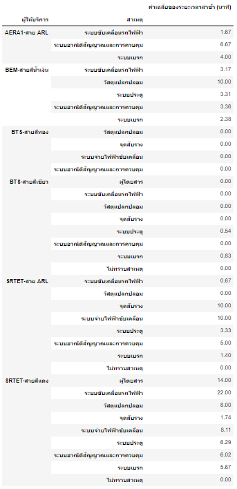
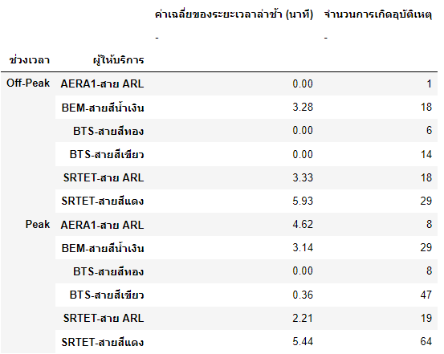
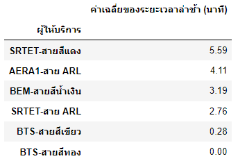
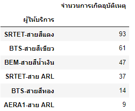

# miniproject_DADS5001

# Topic: อุบัติเหตุทางรถไฟฟ้าที่ไม่ควรทำให้เราเสียเวลา และควรจัดการสาเหตุการเกิดปัญหาอย่างจริงจัง

# Author
นายภูมิ เจวประเสริฐพันธุ์ ID:6420412004 

# Dataset Information
  ข้อมูลที่ระบุจำนวนครั้งในการเกิดเหตุขัดข้อง รวมถึงสาเหตุที่ทำให้รถไฟฟ้าขัดข้อง ของรถไฟฟ้าประเภทต่างๆ เช่น เดือน วันที่เกิดเหตุ เวลา ขบวนรถ เส้นทาง สถานีที่เกิดเหตุขัดข้อง ระยะเวลาล่าช้า(นาที) ผู้ให้บริการ สาเหตุ รายละเอียด
  
# Library and Install
```
import sys
import pandas as pd
from pandas import DataFrame
import numpy as np
import matplotlib.pyplot as plt
import matplotlib as mpl
import seaborn as sns
%matplotlib inline
%config InlineBackend.figure_format='retina'
plt.rcParams['font.family']='Tahoma' 
```

  
# Challenge
  1.มีปัญหาในการหาและนำเข้า dataset เข้ามาใน jupyter notebook เพราะว่ากว่าจะหาข้อมูลที่มีอะไรมาวิเคราะห์ได้ ต้องใช้เวลานาน
  
  2.ปัญหาการตั้งกราฟ เพราะว่าทำข้อมูลที่เป็น multiindex และมี 3 index  ทำให้ไม่รู้ว่าจะ สร้างกราฟยังไงดี เลยต้องไป clean data ใหม่โดยรวมdata 2 column เข้าด้วยกัน
  
  3.ตอน plot graph สาเหตุเทียบกับระยะเวลาล่าช้า(นาที) แล้ว index ที่ 2 ไม่เท่ากันทำให้ plot graph ออกมาแล้วดูเยอะเกินไป และดูยาก
  
  4.มีปัญหาตรงข้อมูลเป็นภาษาไทยเวลา สร้างกราฟเลยต้องเสียเวลาหา font ภาษาไทย
  
  5.sort data ที่เป็น multiindex  ที่มี 2 values ไม่ได้เลยต้องแยกเป็น 2 ตาราง 


# Analysis Question and Answer

  ## 1. วิเคราะห์ว่าแต่ละช่วงเวลา(ช่วงเวลาเร่งด่วน(Peak Hour),ช่วงเวลาไม่เร่งด่วน(Off-Peak Hour)รถไฟฟ้าประเภทไหนที่เกิดเหตุขัดข้องบ่อยที่สุด 
  โดยกำหนด
  ช่วงเวลาเร่งด่วน(5.00 น.- 10.00 น.,17.01 น.-24.01 น.)
  ช่วงเวลาไม่เร่งด่วน(10.01 น.-17.00 น.)
  
  ### ตอบ 
  
  


จากข้อมูล อุบัติเหตุที่เกิดในช่วงเวลาเร่งด่วน (Peak Hour)
```
SRTET-สายสีแดง 64 ครั้ง
BTS-สายสีเขียว 47 ครั้ง
BEM-สายสีน้ำเงิน 29 ครั้ง
SRTET-สาย ARL 19 ครั้ง
BTS-สายสีทอง 8 ครั้ง
AERA1-สาย ARL  8 ครั้ง
```

และ อุบัติเหตุที่เกิดในช่วงเวลาไม่เร่งด่วน (Off-Peak Hour)
```
SRTET-สายสีแดง 29 ครั้ง
SRTET-สาย ARL 18 ครั้ง
BEM-สายสีน้ำเงิน 18 ครั้ง
BTS-สายสีเขียว 14 ครั้ง
BTS-สายสีทอง 6 ครั้ง
AERA1-สาย ARL  1 ครั้ง
```
โดยกราฟจะได้ดังนี้


  ## 2. วิเคราะห์ว่าจากสาเหตุต่างๆ รถไฟฟ้าประเภทไหน ที่ดำเนินการซ่อมแซมที่มีระยะเวลาสูงกว่าค่าเฉลี่ย
  
  ### ตอบ 
  
 ของรถไฟฟ้าแต่ละประเภท.png)
 
 


  จากกราฟ และข้อมูลเราจะเห็นว่าค่าเฉลี่ยที่ได้คือ 3.73
  
  และจะได้รถไฟฟ้าที่ดำเนินการซ่อมแซมเป็นระยะเวลาสูงกว่าค่าเฉลี่ยทั้งหมด 4 ประเภท 13 สาเหตุ

ได้แก่

โดยเรียงลำดับจากรถไฟฟ้าที่ซ่อมนานที่สุดไปน้อยที่สุด
                                      
1.SRTET-สายสีแดง    ระบบขับเคลื่อนรถไฟฟ้า	          22.00 นาที

2.SRTET-สายสีแดง    ผู้โดยสาร	                    14.00 นาที

3.BEM-สายสีน้ำเงิน	  วัสดุแปลกปลอม	                10.00 นาที

4.SRTET-สาย ARL	   จุดสับราง	                    10.00 นาที

5.SRTET-สาย ARL    ระบบจ่ายไฟฟ้าขับเคลื่อน	        10.00 นาที

6.SRTET-สายสีแดง    ระบบจ่ายไฟฟ้าขับเคลื่อน	         8.11 นาที

7.SRTET-สายสีแดง    วัสดุแปลกปลอม	                8.00 นาที

8.AERA1-สาย ARL	   ระบบอาณัติสัญญาณและการควบคุม	  6.67 นาที

9.SRTET-สายสีแดง    ระบบประตู	                     6.29 นาที

10.SRTET-สายสีแดง    ระบบอาณัติสัญญาณและการควบคุม	 6.02 นาที

11.SRTET-สายสีแดง    ระบบเบรก	                    5.67 นาที

12.SRTET-สาย ARL	   ระบบอาณัติสัญญาณและการควบคุม	 5.00 นาที

13.AERA1-สาย ARL	   ระบบเบรก	                    4.00 นาที


   ## 3. จากข้อมูลต่างๆ(ความถี่ในการเกิดอุบัติเหตุ,ระยะเวลาล่าช้า(นาที))โดยอิง'ความถี่ในการเกิดอุบัติเหตุ'ก่อน แล้วดู'ระยะเวลาล่าช้า(นาที)'ตามมาว่า ผู้ให้บริการที่ไหนมีการบริการแย่ที่สุด

   ### ตอบ 
    
    


ของรถไฟฟ้าแต่ละประเภท.png)





จากข้อมูลที่ได้มา รถไฟฟ้าที่มีปัญหาบ่อยที่สุดและ ใช้เวลาดำเนินการซ่อมแซมนานที่สุดคือ SRTET-สายสีแดง โดยรวมทั้ง 2 ช่วงเวลาภายใน 1 ปีเกิดเหตุ ถึง 93 ครั้ง และใช้เวลาซ่อมเฉลี่ยถึง 5.59 นาทีในการดำเนินการซ่อมแซม โดยรองลงมาคือBTS-สายสีเขียวซึ่งเกิดอุบัติเหตุ 61 ครั้ง แต่มีเวลาซ่อมเฉลี่ยไม่นานมาก คือ 0.28 นาที เท่านั้นเอง

จึงเห็นสมควรว่าควรจัดการกับรถไฟฟ้า SRTET-สายสีแดง ได้แล้ว

# ประโยชน์
1.ซึ่งข้อมูลที่ได้มานั้นสามารถ เอาไปตรวจดูและปรับปรุงรถไฟฟ้าในปีต่อๆไปให้ดียิ่งขึ้นได้

2.สามารถนำไปเป็นเหตุผลประกอบการตัดสินใจในการซื้อหุ้นหรือลงทุนด้านอื่นๆได้

3.สามารถนำไปเป็นเหตุผลประกอบการตัดสินใจในการเดินทางโดยรถไฟฟ้าประเภทต่างๆได้


# Reference
1.ข้อมูลสถิติเหตุขัดข้องของรถไฟฟ้าในเมืองปี 2564: https://data.go.th/dataset/stat_incident_metro
